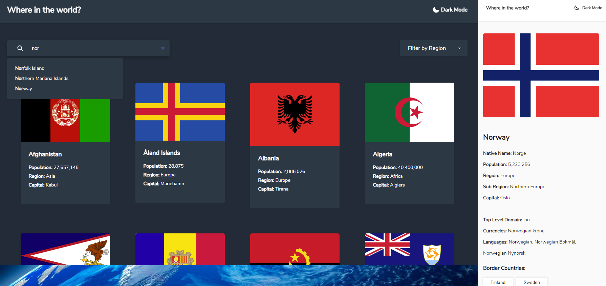

# Frontend Mentor - REST Countries API with color theme switcher solution

This is a solution to the [REST Countries API with color theme switcher challenge on Frontend Mentor](https://www.frontendmentor.io/challenges/rest-countries-api-with-color-theme-switcher-5cacc469fec04111f7b848ca). Frontend Mentor challenges help you improve your coding skills by building realistic projects.

I really enjoyed this project and encourage everyone else to code whatever Frontend Mentor has in store.

## Table of contents

- [Overview](#overview)
  - [The challenge](#the-challenge)
  - [Screenshot](#screenshot)
  - [Links](#links)
- [My process](#my-process)
  - [Built with](#built-with)
  - [What I learned](#what-i-learned)
  - [Continued development](#continued-development)
- [Author](#author)

## Overview

### The challenge

Users should be able to:

- See all countries from the API on the homepage
- Search for a country using an `input` field
- Filter countries by region
- Click on a country to see more detailed information on a separate page
- Click through to the border countries on the detail page
- Toggle the color scheme between light and dark mode _(optional)_

### Screenshot



### Links

- Live Site URL: [Add live site URL here](https://hvor-i-verden.netlify.app)

## My process

### Built with

- Semantic HTML5 markup
- CSS custom properties
- FlexBox
- Mobile-first workflow
- Pure JS, no frameworks or plugins

### What I learned

Use this section to recap over some of your major learnings while working through this project. Writing these out and providing code samples of areas you want to highlight is a great way to reinforce your own knowledge.

This is the first professional website that I have created with just HTML, CSS and JS. I've always used frameworks before so this was a fun challenge.

I learned how manipulate elements using JS.

One example is this function, which gets called in the API fetch return. It takes the "country-list" and adds "country-card"'s to it, using the data from the API. It also applies an onclick event which takes the user to the detail-page of the country they clicked on:

```js
function appendData(data) {
  document.getElementById("country-list").innerHTML = "";
  var countryCard = document.getElementById("country-list");
  for (var i = 0; i < data.length; i++) {
    var div = document.createElement("div");
    div.classList.add("country-card");
    div.setAttribute("id", i);
    div.onclick = function (event) {
      window.location.href =
        "#" + data[event.currentTarget.id].name.toLowerCase();
      findDataWithHash(data[event.currentTarget.id].name.toLowerCase());
    };
    div.innerHTML =
      "" +
      "<div class='stats-section'><h2 class='name'>" +
      data[i].name +
      "</h2>" +
      "<div class='stats-wrap'><span class='stats-title' id='population-title'>Population: </span><span class='stats' id='population'>" +
      getPopulation(data, i) +
      "</span></div>" +
      "<div class='stats-wrap'><span class='stats-title' id='region-title'>Region: </span><span class='stats' id='region'>" +
      getRegion(data, i) +
      "</span></div>" +
      "<div class='stats-wrap'><span class='stats-title' id='capital-title'>Capital: </span><span class='stats' id='capital'>" +
      getCapital(data, i) +
      "</span></div></div>";
    countryCard.appendChild(div);
  }
}
```

Because creating a script that would automatically generate static pages with just JS sounded too cumbersome, I went with going the single page application(SPA) route instead.

I did this using window.location and hashes (#):

```js
function loadHashFromURL() {
  if (window.location.hash == "") {
    window.location.href = "#;)";
  } else if (window.location.hash != "#;)") {
    var hash = window.location.hash.substring(1);
    findDataWithHash(hash);
  }
}

function closeModal() {
  window.location.href = "#;)";
  document.getElementById("country-modal").style.display = "none";
  loadHashFromURL();
}

window.addEventListener("hashchange", function () {
  document.body.style.overflow = "visible";
  document.getElementById("country-modal").style.display = "none";
  loadHashFromURL();
});
```

The findDataWithHash() function is a big script which uses the inbuilt array.find() function and applies the data it finds to a modal which then gets displayed.

Also, I didn't need to but I felt I had to create an "autocomplete" function to the search input:

```js
var autoCompleteArray = [];

function autocompleteName(event) {
  event.stopPropagation();
  document.getElementById("region-menu").style.display = "none";
  if (document.getElementById("search-focus").value.length > 2) {
    document.getElementById("autocomplete-modal").style.display = "block";
  }
  document
    .getElementById("search-focus")
    .addEventListener("input", function () {
      document.getElementById("autocomplete-modal").innerHTML = "";
      var value = document.getElementById("search-focus").value.toLowerCase();
      autoCompleteArray = [];
      for (var i = 0; i < dataStore.length; i++) {
        if (value.length < 2) {
          document.getElementById("autocomplete-modal").style.display = "none";
        } else if (dataStore[i].name.toLowerCase().startsWith(value)) {
          document.getElementById("autocomplete-modal").style.display = "block";
          autoCompleteArray.push(dataStore[i]);
          var firstSlice = dataStore[i].name.slice(0, value.length);
          var lastSlice = dataStore[i].name.slice(value.length);
          document.getElementById("autocomplete-modal").innerHTML +=
            "<li class='autocomplete-name' onclick='clickToFillInput(" +
            i +
            ")'>" +
            "<strong>" +
            firstSlice +
            "</strong>" +
            lastSlice +
            "</li>";
        }
      }
    });
}
```

### Continued development

I mentioned that I was new to coding with only JS and it really shows here. Frameworks like Vue is coded in components, so I never really learned how to have good structure and systems in my code, because coding in components naturally does that for me.
My code here is 100% spaghetti code with added tomato sauce and meat balls. I will be much more careful in the future.
I have too many classes and divs, and my JS needs a lot of refactoring, but I'd rather start a new project right now instead of going back to my mess.
Maybe I will clean it up someday ...

HTML semantics is something that I will learn and use on my next project. It is not necessary, there are professional who use divs only, but I think semantics not only help screen reader, but it helps people (and me), read my code easier.
Example:

```html
<header>
  <h1>Cool Logo</h1>
  <nav>
    <ul class="nav-links">
      <li class="navbar-link">About</li>
      <li class="navbar-link">Contact</li>
      <li class="navbar-link">Content</li>
      <li class="navbar-link">Etc</li>
    </ul>
  </nav>
</header>
```

Instead of:

```html
<div class="header">
  <h1>Cool Logo</h1>
  <div class="navbar">
    <div class="nav-links">
      <div class="navbar-link">About</div>
      <div class="navbar-link">Contact</div>
      <div class="navbar-link">Content</div>
      <div class="navbar-link">Etc</div>
    </div>
  </div>
</div>
```

Needs a tags but you get the point.

I also started learning how to add better commits on github. I imagine it will be very useful when I start working with colleagues.

## Author

- Frontend Mentor - [@yourusername](https://www.frontendmentor.io/profile/daklo91)
